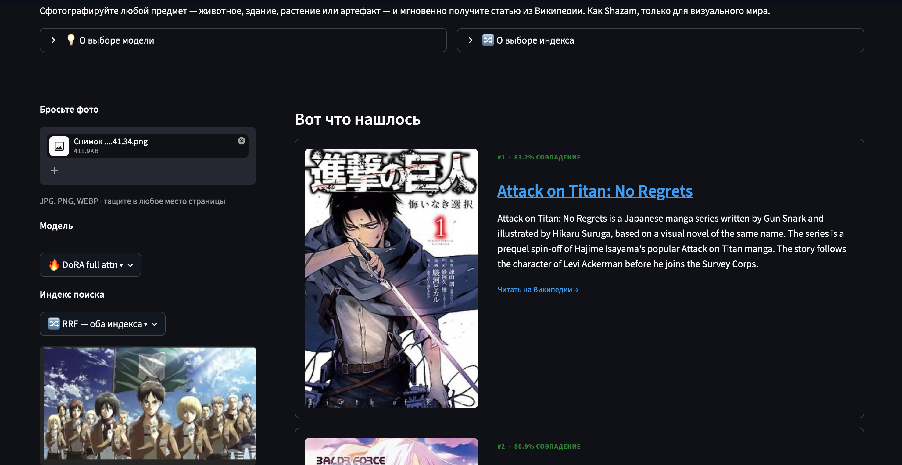

# WikiLens

Ключевая идея проекта: получение векторного представления (эмбеддинга) пользовательской фотографии через CLIP-подобную модель и поиск ближайшего эмбеддинга по базе статей Википедии. Для этого базовая модель дообучалась на парах «фотография из статьи <-> текст статьи».

Проект разделен на три этапа (еще есть создание приложения UI, но это дело не столько интересное): сбор данных, обучение модели и создание индекса. Управление пайплайном происходит через конфигурации в директории `configs/`:
* `data.yaml` — конфигурация сбора данных и их структуры.
* `train.yaml` — параметры обучения моделей.
* `index.yaml` — настройки формирования финальных индексов.

## 1. Данные

Данные собирались в два этапа:
1. Сбор около 110к статей через простые веб-скраперы параллельно на двух машинах (50к и 60к). Эти данные пошли на train и val.
2. Дополнительный сбор 20к популярных (не "ноунейм") статей для расширения базы.

Процесс сопровождался проблемами со скраперами, разными форматами и необходимостью объединять данные из разных источников. К концу этапа пришло понимание, что можно было использовать официальный дамп Википедии, но к этому моменту локальная память была заполнена, а часть моделей уже обучена, поэтому процесс не переделывался.

Формат данных: элемент датасета состоит из `(title, text, photo)`. Данные хранятся в `.jsonl` файлах (одна строка — один элемент). Изображения физически лежат в 5-6 отдельных директориях, пути к ним указаны в JSONL в ключе `file_path`. 

Семантическая аугментация: для обучающих изображений выполнялся поиск Top-K похожих фотографий из датасета ImageNet по косинусному расстоянию в пространстве эмбеддингов zero-shot CLIP. Предподсчет выполняется заранее, чтобы не замедлять процесс обучения, маппинг сохраняется в `aug_map.json`.

Ключевые скрипты:
* `wiki_scraper.py` — скрапер данных.
* `merge_datasets.py` — объединение разрозненных датасетов в один.
* `clean_dataset.py` — очистка данных и распределение на train/val.
* `precompute_aug.py` — предподсчет семантической аугментации.

## 2. Модель

Базовая модель CLIP содержит 151 млн параметров. Из-за аппаратных ограничений машины (MPS 24GB) полное дообучение (Full Fine-Tuning) не применялось. Тестировались три подхода:
1. Использование zero-shot модели без обучения.
2. Заморозка слоев энкодера и обучение только текстовых и визуальных проекторов.
3. Обучение через PEFT-методы (DoRA, LoRA).

Логика построения индекса:
Поскольку дообучение не идеально, эмбеддинги текстов и изображений извлекают специфичный для Википедии смысл немного по-разному. Технически правильнее было бы класть в индекс только тексты, но на практике использование обоих вариантов повышает шансы на успешный поиск. В проекте формируются два отдельных индекса (для текста и для фото), а результаты их поиска объединяются. Лучше всего показал себя алгоритм RRF (Reciprocal Rank Fusion).

Связанные файлы:
* `train.py` — обучение и дообучение (включая PEFT).
* `build_index.py` — формирование FAISS-индекса для изображений.
* `build_text_index.py` — формирование FAISS-индекса для текста.
* `checkpoints/` — директория с логами и конфигами запусков (веса моделей не коммитятся, а загружаются на Hugging Face).
* `run.py` — точка входа для запуска всех процессов.

## 3. Приложение

Приложение реализовано на Streamlit (`app.py`). Архитектура выстроена так, что модели, адаптеры и FAISS-индексы хранятся в репозитории на Hugging Face. При запуске они скачиваются и кэшируются в RAM/tmp. 

Конфигурация доступных моделей задается в `backends.yaml`. Приложение поддерживает переключение моделей и методов индексации на лету из интерфейса.

## 4. Контакты и ссылки

* **Telegram:** [@jnurik](https://t.me/jnurik)
* **Hugging Face:** [jnurik](https://huggingface.co/jnurik)
* **GitHub:** [justnurik](https://github.com/justnurik)
